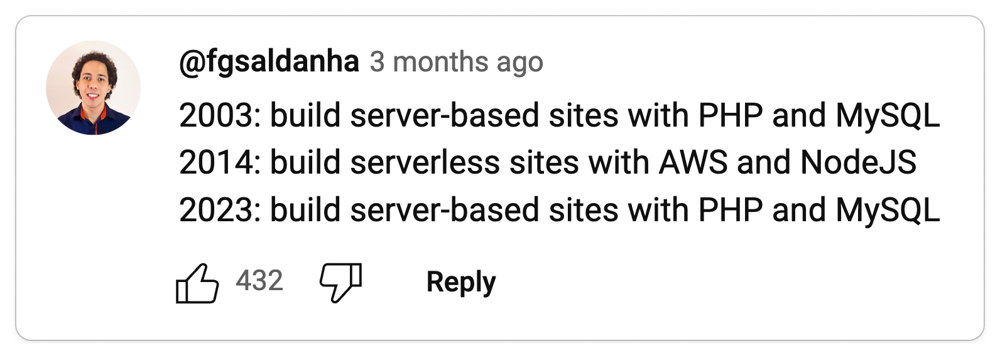
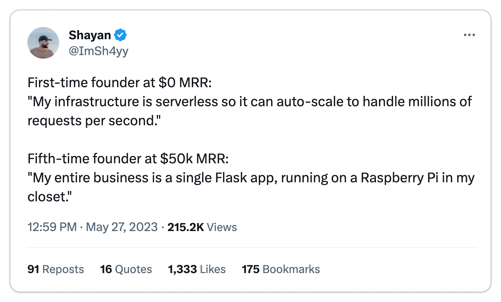
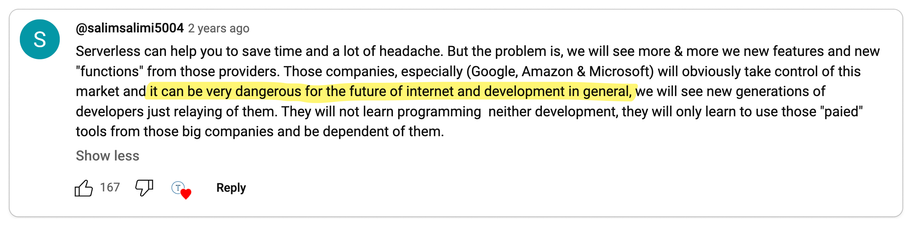
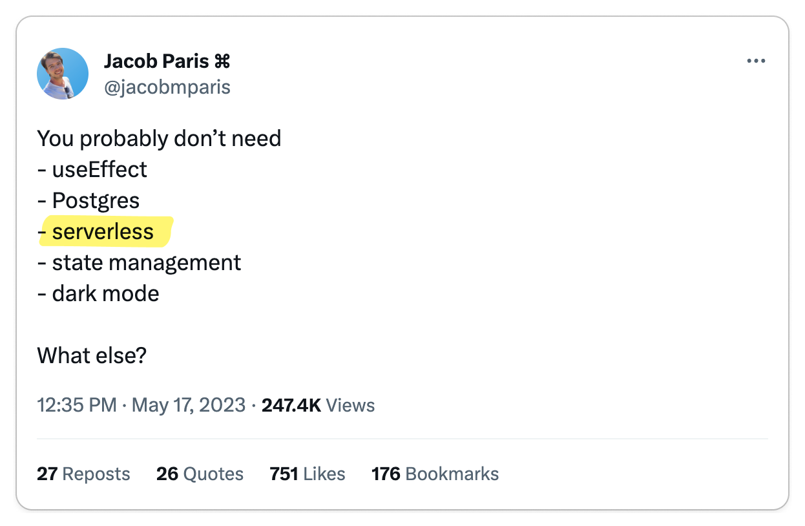
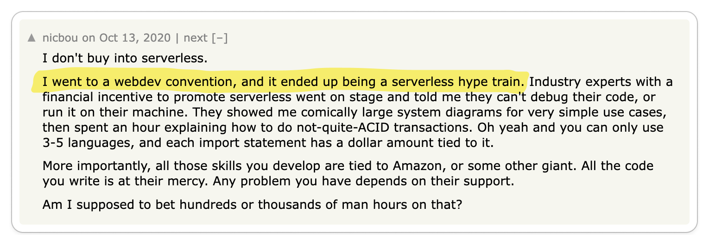
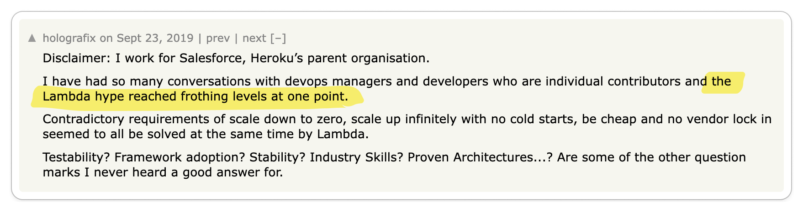
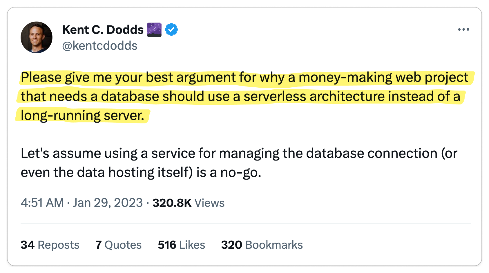
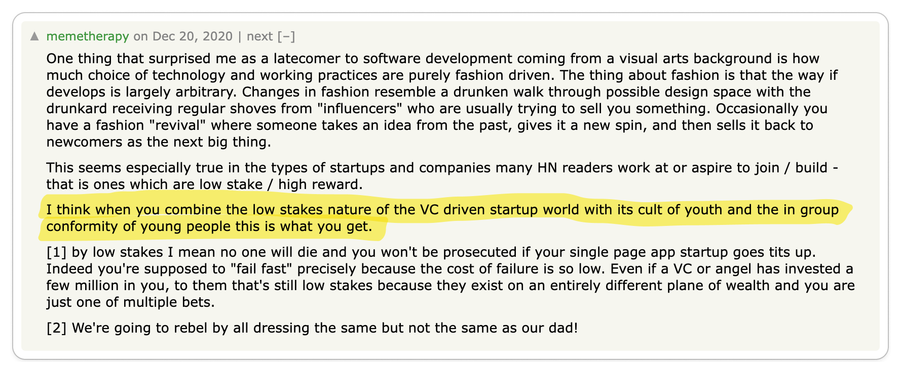
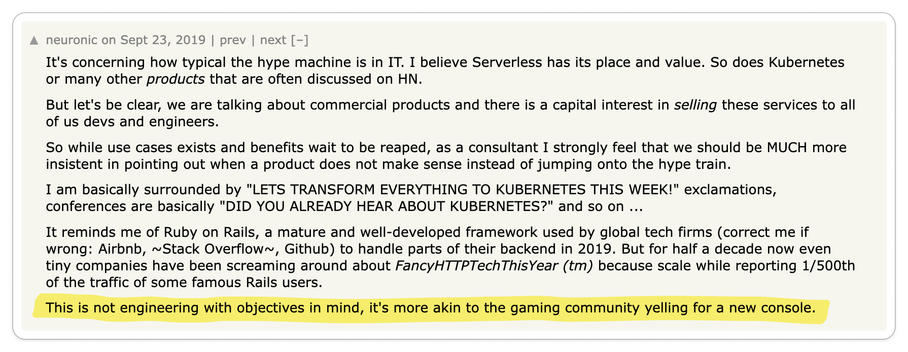
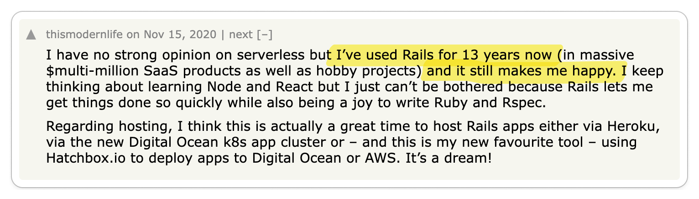

import Head from '@docusaurus/Head';

<Head>
  <title>I Reviewed 1,000s of Opinions on Serverless</title>
  <meta property="og:title" content="I Reviewed 1,000s of Opinions on Serverless"/>
</Head>

From DHH[^dhh] [shunning
serverless](https://world.hey.com/dhh/don-t-be-fooled-by-serverless-776cd730),
Ahrefs [saving millions by using a cloud
provider at all](https://tech.ahrefs.com/how-ahrefs-saved-us-400m-in-3-years-by-not-going-to-the-cloud-8939dd930af8),
to Amazon [raining fire on their own serverless
product](https://www.primevideotech.com/video-streaming/scaling-up-the-prime-video-audio-video-monitoring-service-and-reducing-costs-by-90) [^1],
serverless has recently faced significant scrutiny.

But still, everyone and their pet goldfish seem to be creating a serverless runtime (see
[Bun](https://oven.sh/), [Deno](https://deno.com/deploy),
[Pydantic](https://pydantic.dev/announcement/#2-the-plan),
[Cloudflare](https://workers.cloudflare.com/),
[Vercel](https://vercel.com/features/edge-functions),
[Serverless](https://www.serverless.com), [Neon](https://neon.tech/),
[Planetscale](https://planetscale.com/), [Xata](https://xata.io/),
[FaunaDB](https://fauna.com/), [Convex](https://www.convex.dev/),
[Supabase](https://supabase.com/edge-functions), [Hasura](https://hasura.io/), [Banana](https://www.banana.dev/),
and literally hundreds more). Is it all hype? Is there real 100% objective merit to it? Where
does serverless excel? Where do the trade-offs make sense?

To answer these questions and understand how developers are receiving
serverless, let's look at what developers have to say on Reddit, Twitter, Hacker
News, and YouTube. To do this, I parsed 1,000s of discussions and synthesized my
findings in this article, striving to present only thought-provoking opinions.

<Figure caption='Funnel for gathering through-provoking opinions'>

</Figure>

Next, I transcribed these discussions onto a whiteboard, organizing them into
"Pro Serverless," "Anti Serverless," or "Neutral" categories, and then
clustering them into distinct opinions. Each section in this post showcases
an opinion while referencing pertinent discussions. To conclude, I highlight
a thought-provoking blog post from Amazon that serve as informative case studies
in this ongoing debate.

## Anti-Serverless Opinions

Giant software companies such as Shopify, GitHub, and Stack Overflow have
achieved new heights using tried-and-true frameworks like Ruby on Rails.
However, serverless presents an intriguing new paradigm that promises to reduce
costs, accelerate development, and eliminate the need for maintenance. And as with
any technological shift, there will always be skeptics.

### Opinion: Serverless is a performance and financial hazard

<Carousel.Wrapper>
  <Carousel.Slide>
      <Figure caption={Source: <a href="https://twitter.com/VicVijayakumar/status/1644711481177456644">Twitter</a>}>
  
  </Figure>
  </Carousel.Slide>
  <Carousel.Slide>
      <Figure caption={Source: <a href="https://www.youtube.com/watch?v=W_VV2Fx32_Y&lc=Ugxb0ODqBd78lWf_UiB4AaABAg">YouTube</a>}>
  
  </Figure>
  </Carousel.Slide>
    <Carousel.Slide>
        <Figure caption={Source: <a href="https://www.reddit.com/r/aws/comments/14noh28/is_serverless_worth_the_hype/">Reddit</a>}>
            
        </Figure>
    </Carousel.Slide>
    <Carousel.Slide>
      <Figure caption={Source: <a href="https://news.ycombinator.com/item?id=17949694">Hacker News</a>}>
      
      </Figure>
    </Carousel.Slide>
  <Carousel.Slide>
      <Figure caption={Source: <a href="https://www.youtube.com/watch?v=AuMeockiuLs&lc=Ugx3lwCCM6Qd-XBVDwB4AaABAg">YouTube</a>}>
  
  </Figure>
  </Carousel.Slide>
  <Carousel.Slide>
      <Figure caption={Source: <a href="https://news.ycombinator.com/item?id=21046547">Hacker News</a>}>
  
  </Figure>
  </Carousel.Slide>
  <Carousel.Slide>
      <Figure caption={Source: <a href="https://twitter.com/peer_rich/status/1644437521210769408">Twitter</a>}>
  
  </Figure>
  </Carousel.Slide>
</Carousel.Wrapper>

#### Key Takeaway 🔑

One of the most vocal criticisms of serverless computing is the unpredictability
of its costs and the latency associated with cold starts. While cloud providers
[have made significant improvements in optimizing serverless runtimes](https://blog.cloudflare.com/eliminating-cold-starts-with-cloudflare-workers/) over time,
these issues remain a significant concern for many developers.

Additionally, serverless introduces a new paradigm that brings its own set of
challenges when building complex applications, particularly those requiring
multiple services to communicate with each other. This is already a common
problem with microservices, but serverless further complicates the issue by
forcing developers to work within a stateless and I/O-bound compute model.

These latencies can have real financial consequences; [Amazon found that every
100ms of latency cost them 1% in
sales](https://www.gigaspaces.com/blog/amazon-found-every-100ms-of-latency-cost-them-1-in-sales).
Moreover, without proper billing safeguards in place, serverless costs can
spiral out of control, potentially leading to the infamous situation of a
[startup sinking under its cloud bill](https://news.ycombinator.com/item?id=22719573).

Encountering any of these issues could understandably leave a sour impression
and be a compelling reason to abandon serverless in favor of a traditional VPS.

### Opinion: Serverless is a fad

<Carousel.Wrapper>
  <Carousel.Slide>
    <Figure caption={Source: <a href="">Source: </a>}>
      
    </Figure>
  </Carousel.Slide>
  <Carousel.Slide>
    <Figure caption={Source: <a href="">Source: </a>}>
      
    </Figure>
  </Carousel.Slide>
  <Carousel.Slide>
    <Figure caption={Source: <a href="">Source: </a>}>
      
    </Figure>
  </Carousel.Slide>
  <Carousel.Slide>
    <Figure caption={Source: <a href="">Source: </a>}>
      
    </Figure>
  </Carousel.Slide>
  <Carousel.Slide>
    <Figure caption={Source: <a href="">Source: </a>}>
      
    </Figure>
  </Carousel.Slide>
  <Carousel.Slide>
    <Figure caption={Source: <a href="">Source: </a>}>
      
    </Figure>
  </Carousel.Slide>
  <Carousel.Slide>
    <Figure caption={Source: <a href="">Source: </a>}>
      
    </Figure>
  </Carousel.Slide>
  <Carousel.Slide>
    <Figure caption={Source: <a href="">Source: </a>}>
      
    </Figure>
  </Carousel.Slide>
  <Carousel.Slide>
    <Figure caption={Source: <a href="">Source: </a>}>
      
    </Figure>
  </Carousel.Slide>
  <Carousel.Slide>
    <Figure caption={Source: <a href="">Source: </a>}>
      
    </Figure>
  </Carousel.Slide>
  <Carousel.Slide>
    <Figure caption={Source: <a href="">Source: </a>}>
      
    </Figure>
  </Carousel.Slide>
</Carousel.Wrapper>

#### Key Takeaway 🔑

Serverless is a fad, and the hype will fade.

Kudos to AWS's marketing team, as they have managed to persuade thousands of
developers to stake their entire technology stack on a contentious new paradigm
for building applications.

Some even go as far as to say serverless is a "dangerous" creation
by cloud providers, aimed at seizing control of the market. In some ways, this
viewpoint is not entirely without merit. If cloud providers were not striving to
lock everyone into their products to capture market share and boost revenue,
what kind of corporate entities would they be?

It's rational to be weary of a technology that necessitates developers to
acquire a new set of skills and tools, [potentially wasting developer's time in a potentially
cyclic
technology](https://www.reddit.com/r/FlutterDev/comments/15njq61/i_feel_like_i_mad_a_mistake_investing/).
Engineering teams that adopt serverless need to be cautious about serverless or
else be trapped by "vendor lock-in". When things go wrong, good luck with
troubleshooting and refactoring!

Serverless represents a substantial investment that could arguably be better
allocated to other aspects of the business. Why not utilize long-running servers
that were already [deployable and maintainable in the late
2000s](https://www.google.com/search?q=when+was+heroku+founded&sca_esv=557804163&ei=a1beZJLcDLiWkPIPpa2UiAQ&ved=0ahUKEwjSvZXRmeSAAxU4C0QIHaUWBUEQ4dUDCBA&uact=5&oq=when+was+heroku+founded&gs_lp=Egxnd3Mtd2l6LXNlcnAiF3doZW4gd2FzIGhlcm9rdSBmb3VuZGVkMgUQIRigATIFECEYoAEyBRAhGKABSPIUUABYlxRwBHgAkAEBmAFxoAGFEKoBBDE4Lja4AQPIAQD4AQHCAg4QABiKBRixAxiDARiRAsICDhAuGIoFGLEDGIMBGJECwgIREC4YgAQYsQMYgwEYxwEY0QPCAgsQLhiDARixAxiABMICBRAuGIAEwgIIEAAYgAQYsQPCAgsQABiABBixAxiDAcICCxAuGIAEGMcBGNEDwgIHEAAYigUYQ8ICCBAAGIoFGJECwgINEAAYigUYsQMYgwEYQ8ICDhAuGIAEGLEDGMcBGNEDwgILEC4YigUYsQMYgwHCAgUQABiABMICCBAuGIAEGLEDwgIIEAAYgAQYyQPCAggQABiKBRiSA8ICDRAAGIoFGJECGEYY-wHCAg4QABiKBRixAxiDARjJA8ICBxAuGIAEGArCAgcQABiABBgKwgIWEC4YgAQYChiXBRjcBBjeBBjgBNgBAcICChAAGIAEGEYY-wHCAgoQABiABBixAxgKwgIGEAAYFhgewgIIEAAYigUYhgPiAwQYACBBiAYBugYGCAEQARgU&sclient=gws-wiz-serp).

So, do you **really** need serverless, or are you just succumbing to the hype?

## Pro Serverless Opinions

Technologies that find adoption are not without their merits. And as with all
new technologies, there are early adopters and evangelists that do a great job at
advertising the 10x features.

### Opinion: Serverless accelerates the pace of feature development

### Opinion: Serverless can be outstanding when implemented correctly

## Neutral Opinions

### Opinion: Serverless offers genuine benefits for specific use cases, but it is often misused or applied inappropriately

## Conclusion

[^DHH]: David Heinemeier Hansson, The creator of [Ruby on Rails](https://rubyonrails.org/) and founder of [Basecamp](https://basecamp.com/).
[^1]: Please note that this article addresses a specific issue related to the
design of Amazon's system when using serverless technology. There was no inherent problem with the serverless service itself.