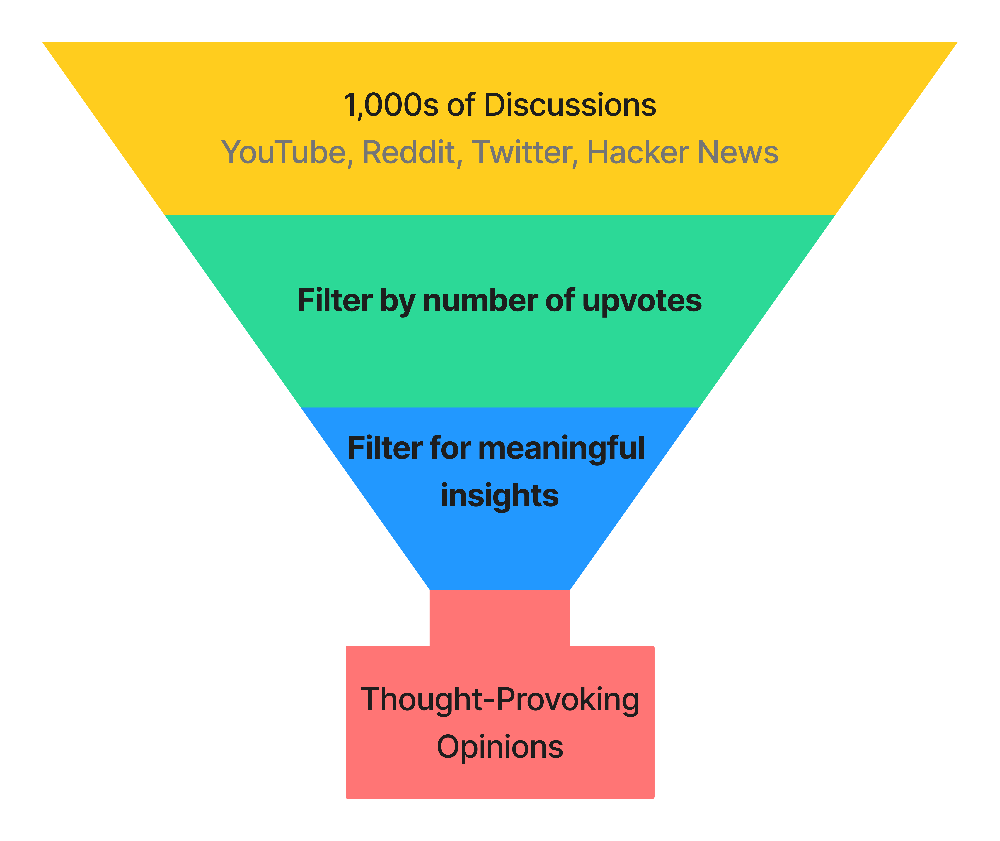

import Head from '@docusaurus/Head';

<Head>
  <title>I Reviewed 1,000s of Opinions on Serverless</title>
  <meta property="og:title" content="I Reviewed 1,000s of Opinions on Serverless"/>
</Head>

From DHH[^dhh] [shunning
serverless](https://world.hey.com/dhh/don-t-be-fooled-by-serverless-776cd730),
Ahrefs [saving millions by using a cloud
provider at all](https://tech.ahrefs.com/how-ahrefs-saved-us-400m-in-3-years-by-not-going-to-the-cloud-8939dd930af8),
to Amazon [raining fire on their own serverless
product](https://www.primevideotech.com/video-streaming/scaling-up-the-prime-video-audio-video-monitoring-service-and-reducing-costs-by-90) [^1],
serverless has recently faced significant scrutiny.

But still, everyone and their pet goldfish seem to be creating a serverless runtime (see
[Bun](https://oven.sh/), [Deno](https://deno.com/deploy),
[Pydantic](https://pydantic.dev/announcement/#2-the-plan),
[Cloudflare](https://workers.cloudflare.com/),
[Vercel](https://vercel.com/features/edge-functions),
[Serverless](https://www.serverless.com), [Neon](https://neon.tech/),
[Planetscale](https://planetscale.com/), [Xata](https://xata.io/),
[FaunaDB](https://fauna.com/), [Convex](https://www.convex.dev/),
[Supabase](https://supabase.com/edge-functions), [Hasura](https://hasura.io/), [Banana](https://www.banana.dev/),
and literally hundreds more). Is it all hype? Is there real 100% objective merit to it? Where
does serverless excel? Where do the trade-offs make sense?

To answer these questions and understand how developers are receiving
serverless, let's look at what developers have to say on Reddit, Twitter, Hacker
News, and YouTube. To summarize developer's opinions, I parsed 1,000s of
discussions and synthesized my findings in this article, striving to present
only thought-provoking opinions.

<Figure caption='Funnel for gathering through-provoking opinions'>

</Figure>

Next, I transcribed these discussions onto a whiteboard, organizing them into
"Pro Serverless," "Anti Serverless," or "Neutral" categories, and then
clustering them into distinct opinions. Each section in this post showcases
an opinion while referencing pertinent discussions. To conclude, I highlight
a thought-provoking blog post from Amazon that serve as informative case studies
in this ongoing debate.

## Anti-Serverless Opinions

### Opinion: Serverless is a performance and financial hazard

<Carousel.Wrapper>
  <Carousel.Slide>
      <Figure caption={Source: <a href="https://twitter.com/VicVijayakumar/status/1644711481177456644">Twitter</a>}>
  
  </Figure>
  </Carousel.Slide>
  <Carousel.Slide>
      <Figure caption={Source: <a href="https://www.youtube.com/watch?v=W_VV2Fx32_Y&lc=Ugxb0ODqBd78lWf_UiB4AaABAg">YouTube</a>}>
  
  </Figure>
  </Carousel.Slide>
    <Carousel.Slide>
        <Figure caption={Source: <a href="https://www.reddit.com/r/aws/comments/14noh28/is_serverless_worth_the_hype/">Reddit</a>}>
            
        </Figure>
    </Carousel.Slide>
    <Carousel.Slide>
      <Figure caption={Source: <a href="https://news.ycombinator.com/item?id=17949694">Hacker News</a>}>
      
      </Figure>
    </Carousel.Slide>
  <Carousel.Slide>
      <Figure caption={Source: <a href="https://www.youtube.com/watch?v=AuMeockiuLs&lc=Ugx3lwCCM6Qd-XBVDwB4AaABAg">YouTube</a>}>
  
  </Figure>
  </Carousel.Slide>
  <Carousel.Slide>
      <Figure caption={Source: <a href="https://news.ycombinator.com/item?id=21046547">Hacker News</a>}>
  
  </Figure>
  </Carousel.Slide>
  <Carousel.Slide>
      <Figure caption={Source: <a href="https://twitter.com/peer_rich/status/1644437521210769408">Twitter</a>}>
  
  </Figure>
  </Carousel.Slide>
</Carousel.Wrapper>

#### Key Takeaway 🔑

### Opinion: Serverless is a fad

## Pro Serverless Opinions

### Opinion: Serverless accelerates the pace of feature development

### Opinion: Serverless can be outstanding when implemented correctly

## Neutral Opinions

### Opinion: Serverless offers genuine benefits for specific use cases, but it is often misused or applied inappropriately

## Conclusion

[^DHH]: David Heinemeier Hansson, The creator of [Ruby on Rails](https://rubyonrails.org/) and founder of [Basecamp](https://basecamp.com/).
[^1]: Please note that this article addresses a specific issue related to the
design of Amazon's system when using serverless technology. There was no inherent problem with the serverless service itself.