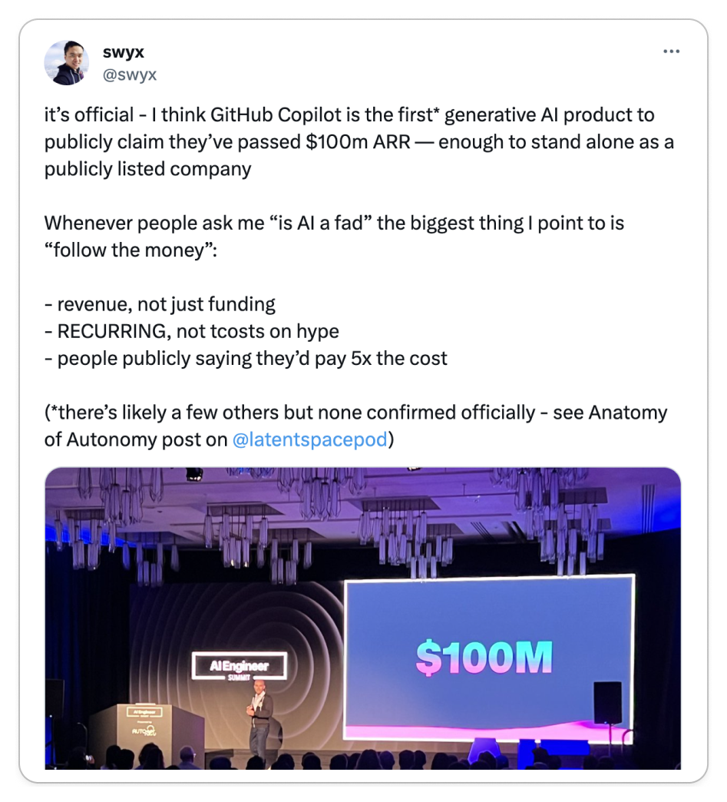
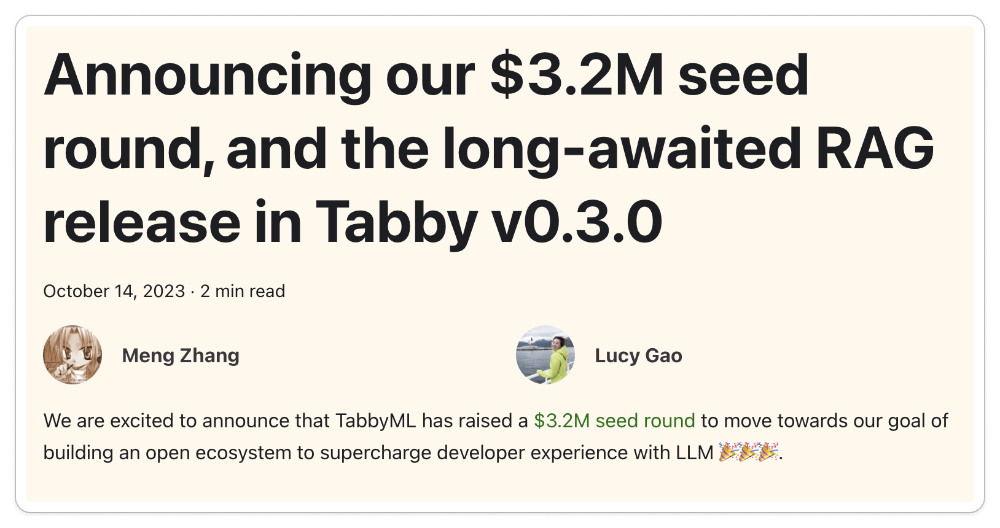
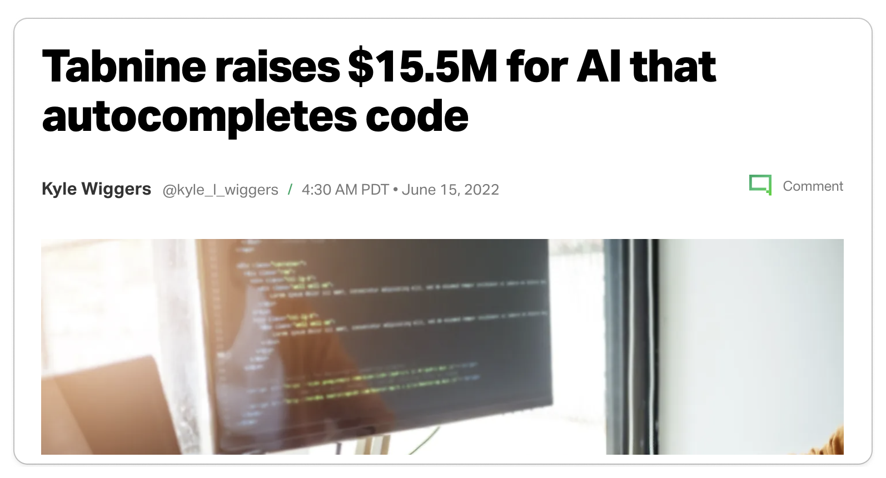
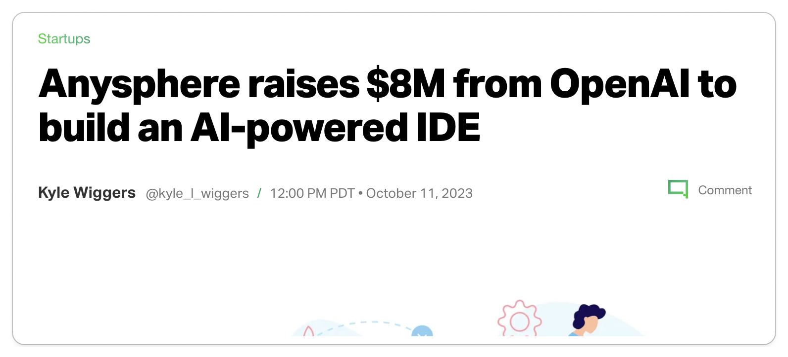
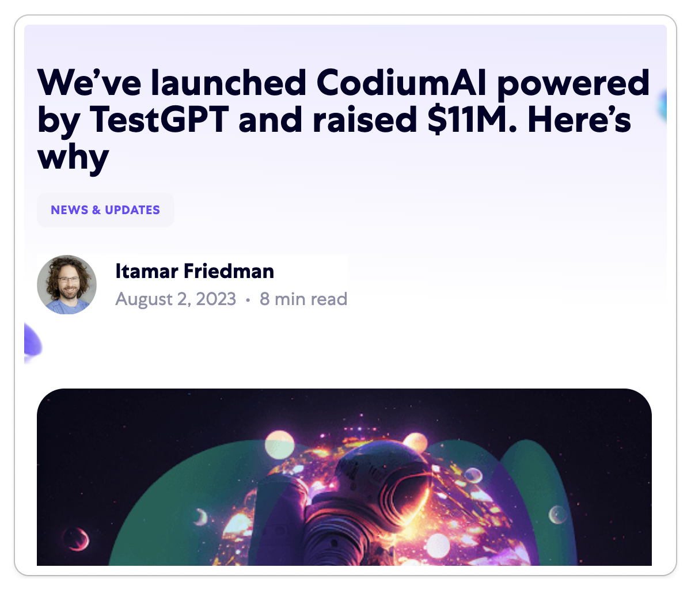
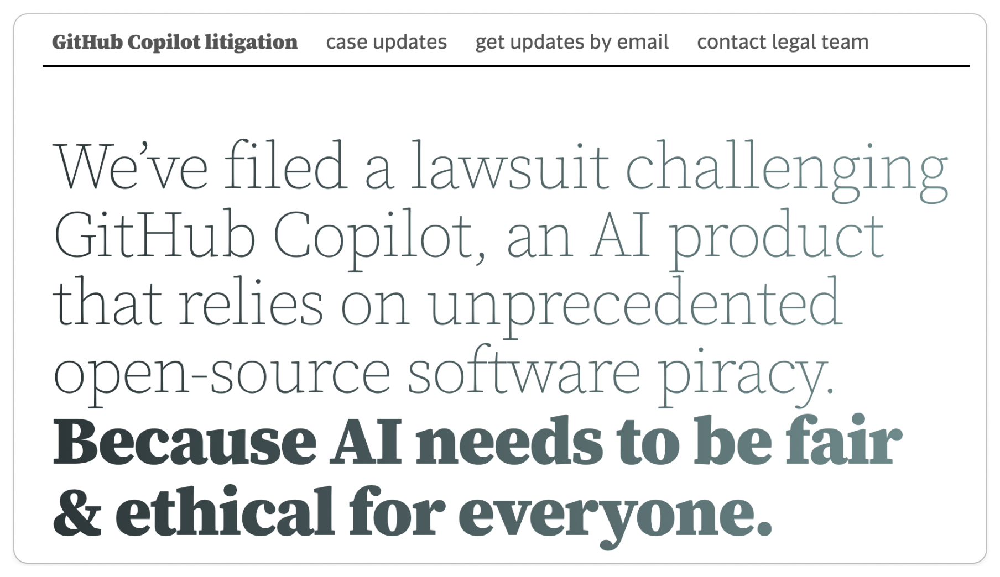
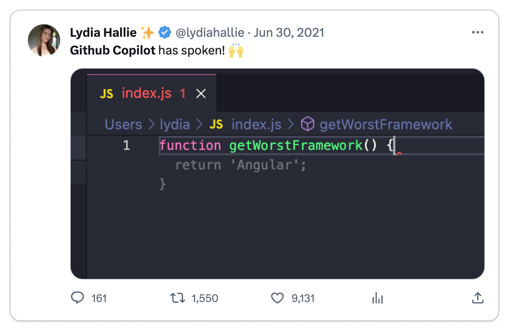
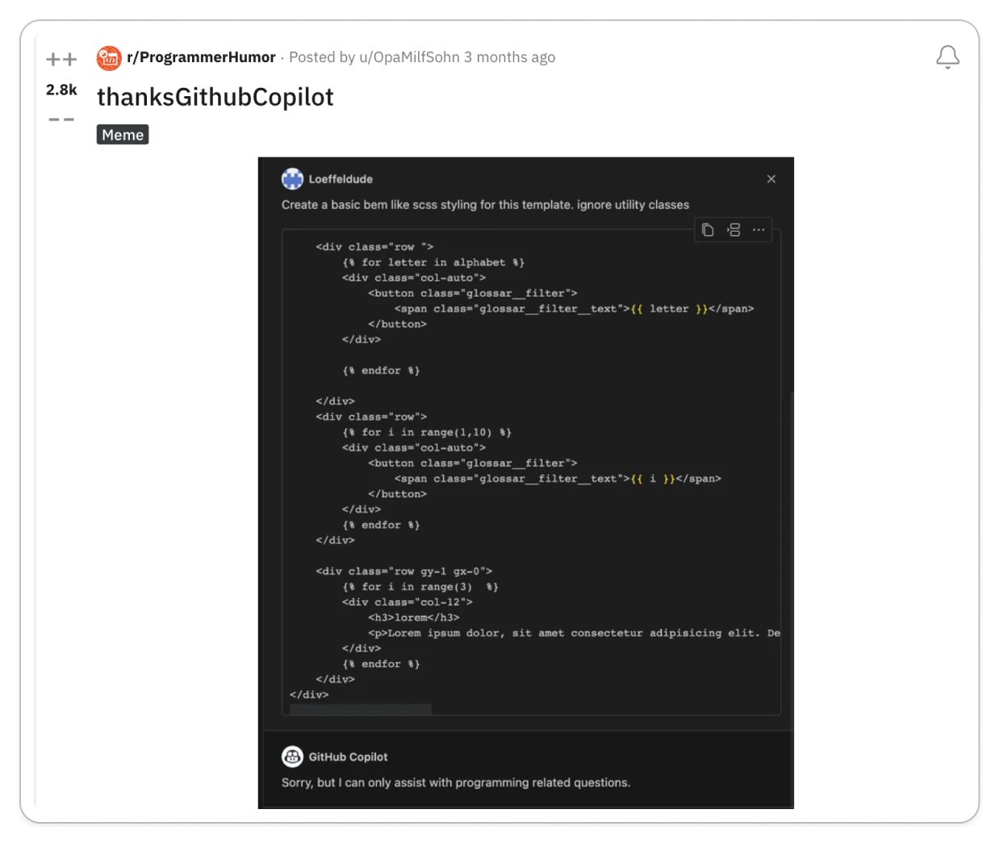
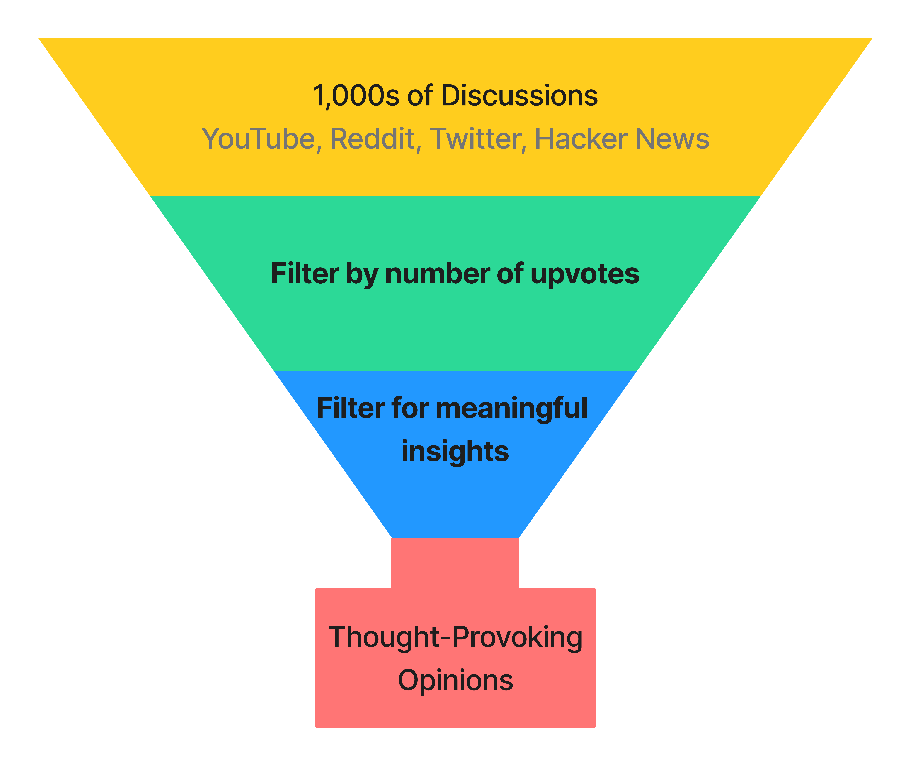

import Head from '@docusaurus/Head';

<Head>
  <title>I Reviewed 1,000s of Opinions on GitHub Copilot</title>
  <meta property="og:title" content="I Reviewed 1,000s of Opinions on Github Copilot"/>
</Head>

GitHub Copilot has recently taken the software engineering world by storm and
just hit a [milestone of $100M
ARR](https://twitter.com/swyx/status/1711792178031460618?s=46&t=3D8YW9UxdZo4eiYzLsOALw),
which is enough to stand alone as a publicly listed company. Funding is starting
to pour into code-focused LLM use-cases.

<Carousel.Wrapper>
  <Carousel.Slide>
      <Figure caption={<a href="https://twitter.com/swyx/status/1711792178031460618?s=46&t=3D8YW9UxdZo4eiYzLsOALw">GitHub Copilot crosses 100M ARR Milestone</a>}>
        
      </Figure>
  </Carousel.Slide>
  <Carousel.Slide>
      <Figure caption={<a href="https://tabby.tabbyml.com/blog/2023/10/14/seed-round-release-0-3-0-RAG/">TabbyML Raising 3.2M for an open-source GitHub Copilot</a>}>
        
      </Figure>
  </Carousel.Slide>
  <Carousel.Slide>
      <Figure caption={<a href="https://techcrunch.com/2022/06/15/tabnine-raises-15-5m-for-ai-that-autocompletes-code/?guccounter=1">Tabnine raises $15.5M for AI that autocompletes code</a>}>
        
      </Figure>
  </Carousel.Slide>
  <Carousel.Slide>
      <Figure caption={<a href="https://techcrunch.com/2023/10/11/anysphere-raises-8m-from-openai-to-build-an-ai-powered-ide/">Anysphere raises $8M from OpenAI to build an AI-powered IDE</a>}>
        
      </Figure>
  </Carousel.Slide>
  <Carousel.Slide>
      <Figure caption={<a href="https://www.codium.ai/blog/codiumai-powered-by-testgpt-accounces-beta-and-raised-11m/">CodiumAI raises $11M</a>}>
        
      </Figure>
  </Carousel.Slide>
</Carousel.Wrapper>

{/* TRUNCATE */}

But code-focused LLM products also brought its fair share of [controversy](https://githubcopilotlitigation.com/) and entertaining
results.

<Carousel.Wrapper>
  <Carousel.Slide>
    <Figure caption={<a href="https://githubcopilotlitigation.com/">Lawsuit against GitHub Copilot</a>}>
      
    </Figure>
  </Carousel.Slide>
  <Carousel.Slide>
    <Figure caption={<a href="https://x.com/lydiahallie/status/1410321569113649152?s=20">Funny prediction by GitHub Copilot from Twitter</a>}>
      
    </Figure>
  </Carousel.Slide>
  <Carousel.Slide>
    <Figure caption={<a href="https://www.reddit.com/r/ProgrammerHumor/comments/15h0rpl/thanksgithubcopilot/">Funny chat response by GitHub Copilot from Reddit</a>}>
      
    </Figure>
  </Carousel.Slide>
</Carousel.Wrapper>

**But leaving controversy aside, which can be a whole article in itself, this
article is about the opinions of developers on the product itself in spite of the
controversy.**

<Admonition title="Disclosure" type="info">
We pay for GitHub Copilot because we feel it makes us code faster but we have no
affiliation with GitHub or Microsoft. We were not paid to write this article.

We just want to know what the average developer thinks about GitHub Copilot.
What are the most common complaints? What are the most common praises?
</Admonition>

To understand how developers are receiving Copilot, I went to where
developers live: Reddit, Twitter, Hacker News, and YouTube. I parsed 1,000s of
discussions and synthesized my findings in this article, striving to present
only thought-provoking opinions.

<Figure caption='Funnel for gathering through-provoking opinions'>

</Figure>

Next, I transcribed these discussions onto a whiteboard, organizing them into
"Pro Copilot," "Anti Copilot", or "Neutral" categories, and then clustering them
into distinct opinions. Each section in this post showcases an opinion while
referencing pertinent discussions.

<Figure caption='Whiteboard of opinions'>
TODO
</Figure>

## Anti-Copilot Opinions

### Opinion: Copilot is a performance and financial hazard
### Opinion: Copilot is a fad
## Pro Copilot Opinions
### Opinion: Copilot accelerates the pace of feature development
### Opinion: Copilot can be outstanding when implemented correctly
## Neutral Opinions
### Opinion: Copilot offers genuine benefits for specific use cases, but it is often misused or applied inappropriately

# Conclusion
