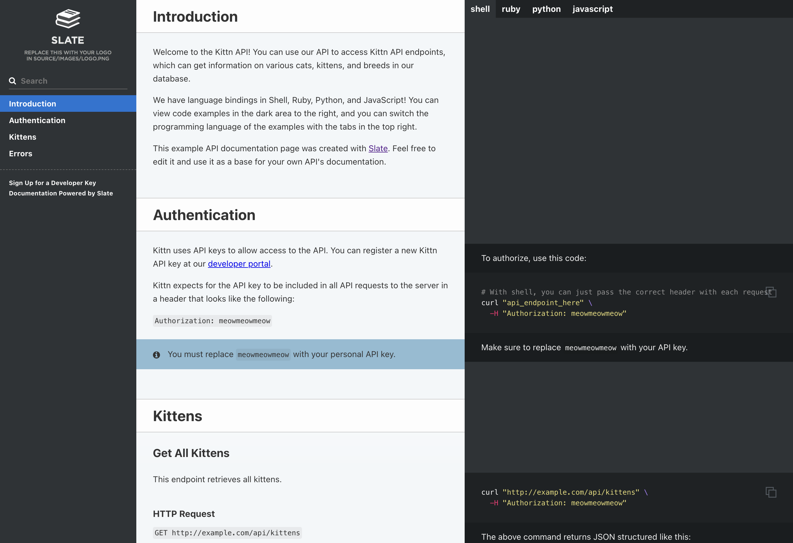
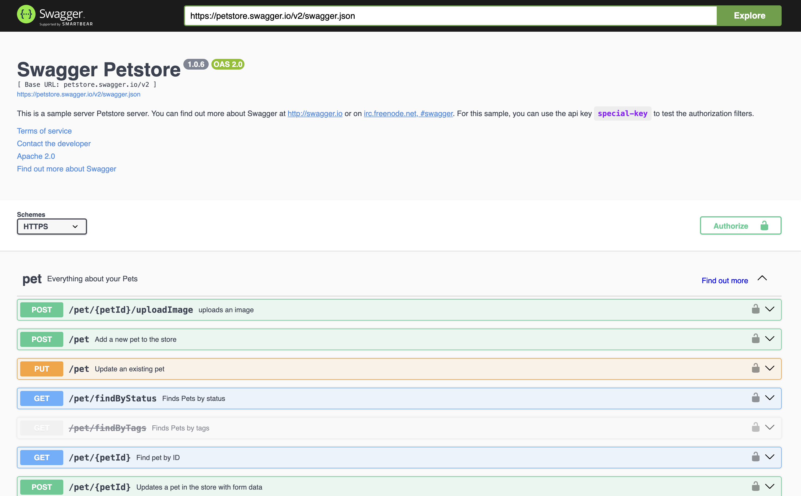
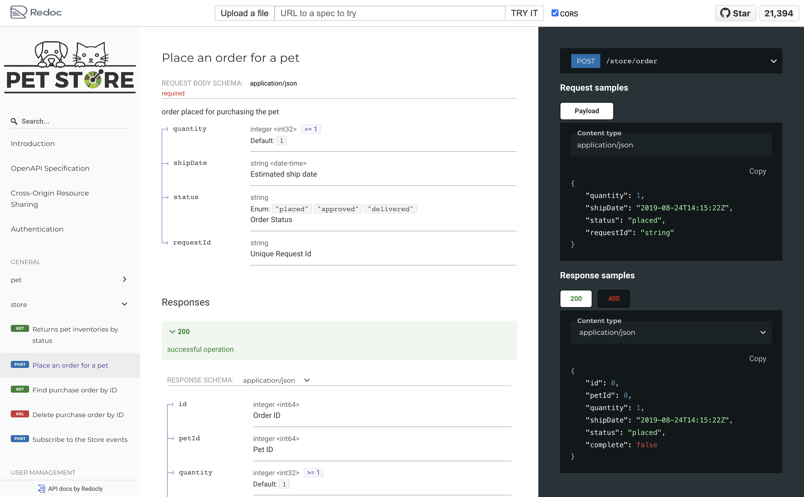
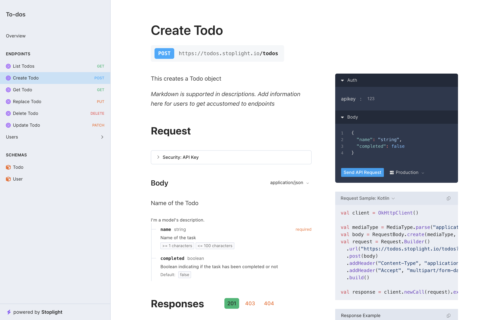
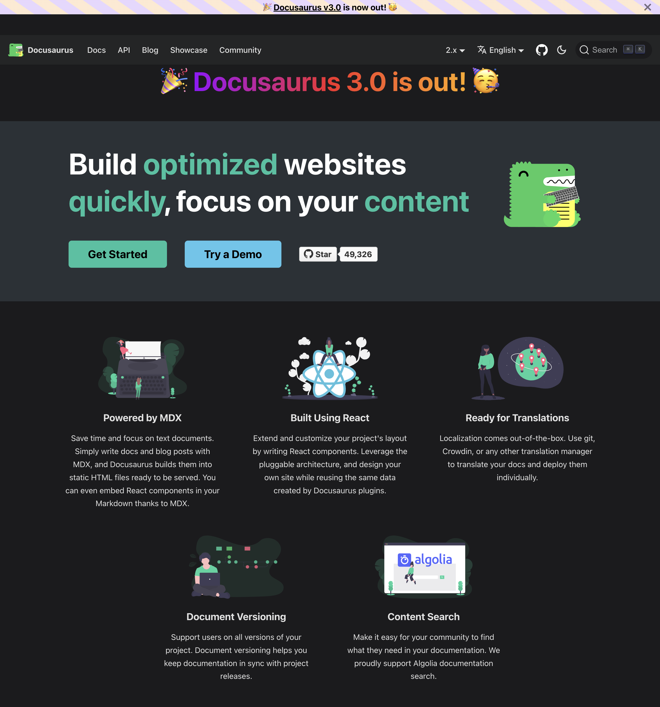
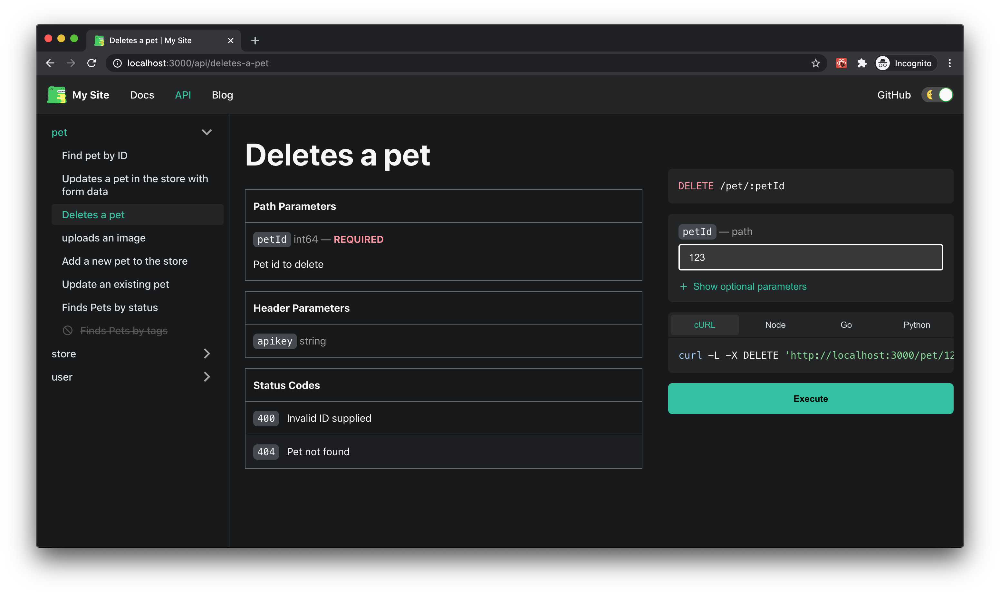
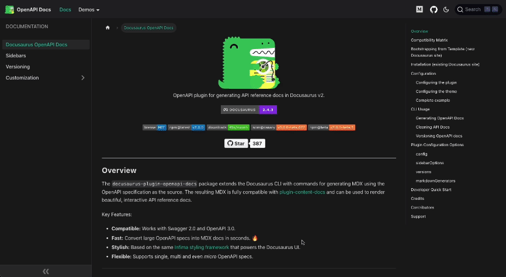
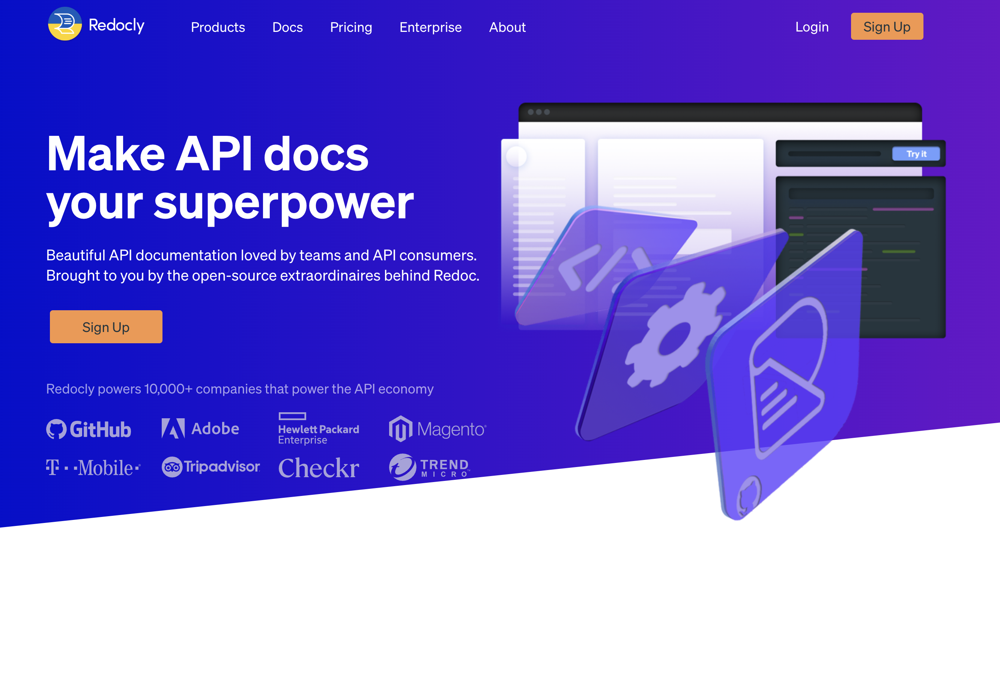
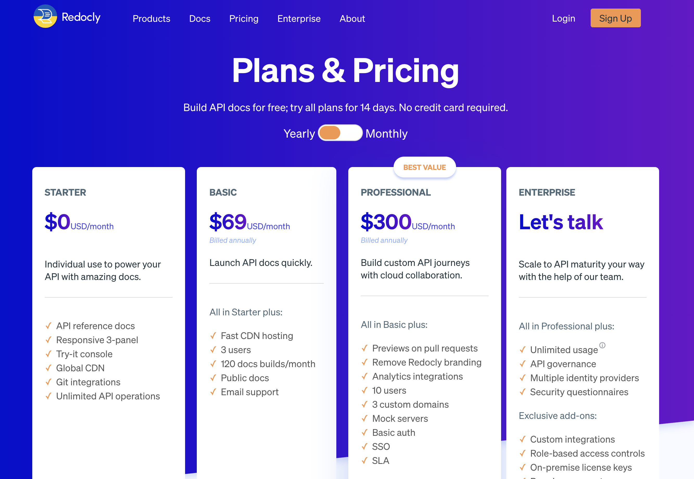

[OpenAPI](/blog/openapi) makes it really easy to generate documentation for your API. There are a
number of open source and paid solutions that make it easy to generate
documentation for your API. To find out which solution is best for you, we
researched and compared the best open source and paid OpenAPI documentation
generators.

<Admonition type="info">
All tools mentioned support generation of comprehensive documentation from an OpenAPI specification.
</Admonition>

## Open Source

If you have the bandwidth to setup and maintain your own OpenAPI documentation
generator, then you should consider using one of the following open source
solutions. Open Source solutions are always free and usually highly
customizable.

### [Slate](https://github.com/slatedocs/slate)

<Figure caption={<a href="https://slatedocs.github.io/slate/#introduction">Demo of Slate</a>}>

</Figure>

| GitHub | Docker |
| --- | --- |
|  | 

Slate is a beautiful static documentation generator for OpenAPI. It's UI/UX is unique in that
it puts everything on a single page.

#### Pros

- Git-based
- Free and open-source
- Great community support with large number of GitHub stars
- Generates static code Snippets for making API requests
- Supports custom documentation with Markdown
- Supports custom code snippets

#### Cons

- Requires technical resources for installation and maintenance
- Support for custom layout is limited
- Compared to other solutions, the feature set is limited and design is less
modern

### [Swagger UI](https://github.com/swagger-api/swagger-ui)

<Figure caption={<a href="https://petstore.swagger.io/">Demo of Swagger UI</a>}>

</Figure>

| GitHub | NPM |
|  --- | --- |
|  |  |

Swagger UI is one of the earliest OpenAPI documentation generators. OpenAPI
(formerly known as Swagger), is open sourced by
[SmartBear](https://smartbear.com/) and is the most popular OpenAPI
documentation generator.

#### Pros

- Integrates with SwaggerHub
- Integrates with Spring Boot
- Great community support with large number of GitHub stars
- Interactive API requests in the browser

#### Cons

- UI/UX is a little out-dated
- Does not support custom documentation

### [Redoc](https://github.com/Redocly/redoc)

<Figure caption={<a href="https://redocly.github.io/redoc/">Demo of Redoc</a>}>

</Figure>

| GitHub | NPM |
|  --- | --- |
|  |  |

Redoc is another beautiful static documentation generator for OpenAPI open sourced by [Redocly](https://redocly.com/).

#### Pros

- Supports OAS 3.1 Webhooks
- Git-based
- Can be integrated into your existing website
- Supports custom code samples through a vendor extension
- Lots of [configuration options](https://redocly.com/docs/redoc/config/)
- Helpful customization options through [various vendor extensions](https://redocly.com/)

#### Cons

- UI/UX is a little clunky looking
- Does not support custom documentation
- Does not support making API requests from the browser
- Limited feature set compared to the paid version (see differences [here](https://redocly.com/redoc-vs-reference/))

### [Elements](https://github.com/stoplightio/elements)

<Figure caption={<a href="https://elements-demo.stoplight.io/#/operations/post-todos">Demo of Elements</a>}>

</Figure>

| GitHub | NPM |
|  --- | --- |
|  |  |

Elements is a documentation generator for OpenAPI open sourced by [Stoplight](https://stoplight.io/).

#### Pros

- The best UI/UX of open source OpenAPI documentation generator
- Generates documentation for schemas
- Automatically generates code samples for making API requests
- Can be integrated into your existing website
- Allows for custom documentation
- Supports making API requests from the browser
- Integrates with [Stoplight Platform](https://stoplight.io/solutions)

#### Cons

- Not as popular as other open source solutions
- Requires technical resources for installation and maintenance
- Support for custom layout is limited

### Plugins for Docusaurus

<Figure caption="Documentation for Docusaurus">

</Figure>

| Plugin | GitHub | NPM |
| --- | --- | --- |
| [docusaurus-openapi](https://github.com/cloud-annotations/docusaurus-openapi) |  |  |
| [docusaurus-openapi-docs](https://github.com/PaloAltoNetworks/docusaurus-openapi-docs) |  |  |

Docusaurus is an open-source, static site generator developed by Facebook's
team, built on React, and suitable for teams publishing documentation.

If you are already using Docusaurus, there are two plugins for Docusaurus for generating OpenAPI documentation:

<Carousel.Wrapper>
<Carousel.Slide>
    <Figure caption="docusaurus-openapi">
    
    </Figure>
</Carousel.Slide>
<Carousel.Slide>
    <Figure caption="docusaurus-openapi-docs">
    
    </Figure>
</Carousel.Slide>
</Carousel.Wrapper>

Both plugins are nearly equivalent in terms of feature set. We personally like
the UI/UX of `docusaurus-openapi-docs` better but `docusaurus-openapi` has more
stars on GitHub. We suggest you try both and see which one you like better or simply works
better for your OpenAPI specification.

#### Pros

- Git-based
- Free and open-source
- Highly customizable
- Configurable layout/navigation
- SEO optimized
- Supports blog posts
- Supports MDX and JSX.
- Generates static code Snippets for making API requests
- Great search integrations with Algolia or offline search
- Rich Plugin Ecosystem
- Supports multiple versions of your API
- Supports custom documentation with Markdown

#### Cons

- Requires technical resources for installation and maintenance.
- Can be costly in terms of technical expertise to setup and maintain
- UI/UX for OpenAPI plugins is not as polished as paid solutions
- Needs a secure proxy to enable interactive requests in the browser

## Paid (Monthly Fee)

If the open source solutions are not a good fit for you, then you should
consider using one of the following paid solutions. Paid solutions are usually
hosted and maintained by the company that created them. This means that you
don't have to worry about installation and maintenance. Paid solutions are
usually more feature rich and have better UI/UX than open source solutions.

### [Redocly](https://redocly.com/)

<Figure caption={<a href="https://redocly.com">Redocly Landing Page</a>}>

</Figure>

Redocly is a paid solution for generating OpenAPI documentation. Redocly is
developed by the same company that open sourced Redoc.

#### Pros

- Managed solution
- Great search capabilities
- Allows making API requests from the browser
- Great UI/UX
- Integrates with [GitHub](https://redocly.com/docs/workflows/sources/github/#github)
- Embeddable into your existing website
- Supports custom documentation with [extended Markdown features](https://redocly.com/docs/developer-portal/guides/markdown/)
- Supports [step-by-step tutorials](https://redocly.com/docs/developer-portal/guides/step-by-step/) with embedded API request examples

#### Cons

- Paid
- Basic plan is limited
- Expensive if you just want a custom domain

#### Pricing

<Figure caption={<a href="https://redocly.com/pricing/">Redocly Pricing Page</a>}>

</Figure>

### Stoplight

### Readme.com

### Bump.sh

### Document360

### Doctave

### Konfig

<Admonition type="warning" title="Full disclosure">
We are the creators of Konfig and are including our product on this list for
promotion. Konfig makes it easy to generate beautiful and interactive OpenAPI
documentation for your API. Konfig also generates SDKs for your API to make it
easy for your users to consume your API.

We believe that Konfig offers a compelling advantage over other solutions for
API developers by also [generating SDKs](https://konfigthis.com/#sdks) that
natively integrate into your API documentation.

[Learn more here](https://konfigthis.com)
</Admonition>

## Our Opinion

If you are looking for a free and open source solution, we recommend using
[Elements](https://github.com/stoplightio/elements) as it has the best UI/UX and
is the most feature rich of the open source solutions.

If you are already
using a server framework like [Spring
Boot](https://spring.io/projects/spring-boot) or
[Express](https://expressjs.com/), then you should consider using [Swagger
UI](https://github.com/swagger-api/swagger-ui) as there are already integrations
for these frameworks.

If you are already using [Docusaurus](/blog/penapi-documentation-generators#plugins-for-docusaurus), then you should consider using one of the two
plugins for Docusaurus.

If you are in the market for a paid solution.

