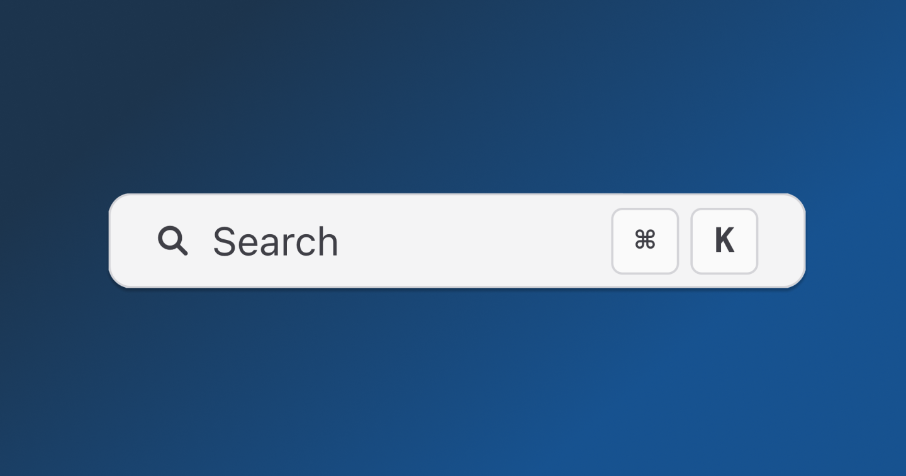
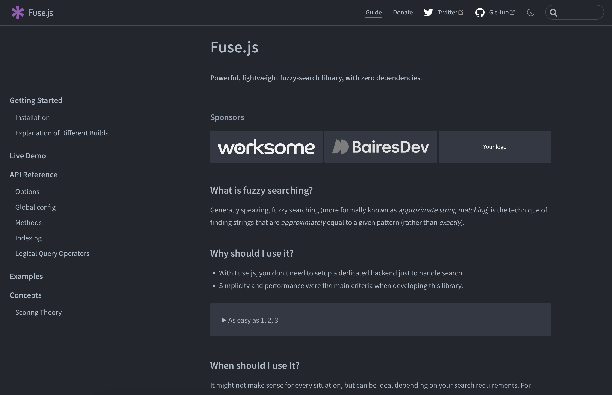

<Admonition type="info">
This article teaches you how to implement free, fast, and local search using
Fuse.js in Next.js. If you are looking for an API docs provider with great
out-of-the-box search functionality, consider using [Konfig](/#docs) to host
your API docs.
</Admonition>

Most websites worth its salt have a search bar. It's a great way to help users
find the content they need quickly. To migrate one of our customers at
[Konfig](https://konfigthis.com) from [ReadMe](https://readme.com/) to our [Docs
product](/#docs), we needed to reach feature parity with their docs product,
which meant adding search functionality.

## What we built

An fast, and local-first search bar with fuzzy search, highlighting. Oh, and its
free to host and doesn't require any external services. The experience is slick
and fast and you can try it out for yourself at SnapTrade's
[Docs](https://docs.snaptrade.com).

<Figure caption="Demo of Slick Search Functionality">
<VideoPlayer autoplay url="/video/docs-search.mov"/>
</Figure>

## How did we do did this?

We used a neat open-source library called [Fuse.js](https://fusejs.io/). It's a
lightweight library that allows you to implement fuzzy search in your app.

<Figure caption="The Fuse.js Docs">

</Figure>

Fuse.js has a lot of stars and a decent amount of downloads on NPM. It's also
actively maintained. Great library, do recommend.

| GitHub | NPM |
|  --- | --- |
| [](https://github.com/krisk/fuse) | [](https://www.npmjs.com/package/fuse.js) |

### Why use Fuse.js instead of Algolia?

In our case, the requirements were as follows:

1. Cheap/free
1. Simple (preferrably local-first)
1. Fast
1. Error-prone (fuzzy search)
1. Supports custom indexing of markdown files and JSON data (for OpenAPI generated docs)
1. Supports isolated indexing of docs for each customer
1. Works with [SSR](https://nextjs.org/docs/pages/building-your-application/rendering/server-side-rendering) (in our case we are using Incremental Static Regeneration) in Next.js

Algolia could have solved our problem and its a great service, but it's free
tier is a little limited and I was a little worried about the cost of scaling it
up at $0.50 per 1,000 search requests.


It's also not local-first. This means that you have to send your data to Algolia
and then query it. This is fine, but it's not ideal. Furthermore, by just
connecting a few dots, it was easy enough to build search functionality for our
docs product so we decided to go with Fuse.js.

## How to implement search functionality using Fuse.js with Next.js SSR

<Admonition type="info">
Note that this tutorial assumes two things:

1. You are using Next.js using the [pages router](https://nextjs.org/docs/pages) as opposed to the new app
router. If you are using the new app router, you will need to modify the code in
this tutorial.
1. You are using [SSR](https://nextjs.org/docs/pages/building-your-application/rendering/server-side-rendering) to generate your pages at runtime

The code in this tutorial is a pseudo-code implementation of the search
functionality we built for our [Docs product](/#docs). It is not a copy-paste
solution. You will need to modify the code to fit your own application.

</Admonition>

Search functionality can be broken down into three main parts:

1. **Aggregate** the content to index
1. **Index** the content for fast queries
1. **Serve** a UI to make queries on the index

#### Adding Fuse.js to your Next.js project

First, ensure Fuse.js is installed in your project.

<CH.Code>

```bash yarn
yarn add fuse.js
```

```bash npm
npm install fuse.js
```

```bash pnpm
pnpm add fuse.js
```

</CH.Code>

<CH.Scrollycoding>

### Create an SSR page in Next.js

Create a page in Next.js that uses SSR to generate the page at runtime. Here is a simple example
of a page that uses ISR to generate the page at runtime.

```tsx pages/[myPage].tsx
// from ./implementing-search-assets/page.tsx
```

---

### Aggregate the content to index

While generating props for your page, aggregate all the content you want to
index for searching. For your own application, you will need to decide what
content you want to aggregate for searching. In our case, we wanted to index the
following content:

1. Markdown files
1. JSON files that represent [OpenAPI Specifications](https://swagger.io/specification/)

In this most cases this content is going to contain information from pages other than
the currently rendered page. For example, if you are on the page `/foo`, you
will want to aggregate the content from `/bar` and `/baz` as well.

```tsx pages/[myPage].tsx focus=25:43,59
```

---

### Index the content for fast queries

Let Fuse.js do the heavy-lifting here.

Since all the content necessary for searching is already available in the
browser, we can index the content in the browser. This is a great way to
implement search functionality without having to rely on external services.

Its incredibly easy to index content using Fuse.js. All you need to do is
instantiate a new `Fuse` object with the content you want to index and the
options you want to use for searching.

```tsx pages/[myPage].tsx focus=45:55
```

---

### Serve a UI to make queries on the index

Now that we have indexed the content, we need to serve a UI to make queries on
the index. This is the fun part. You can use Fuse.js to make queries on the
index and then render the results however you want.

```tsx pages/[myPage].tsx focus=
```

</CH.Scrollycoding>