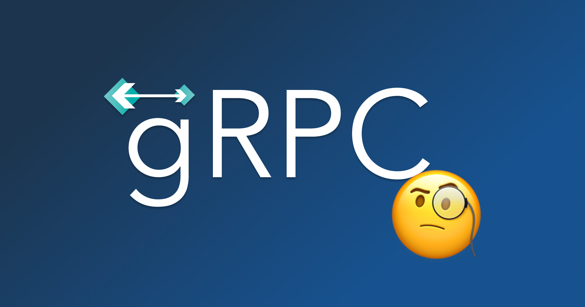
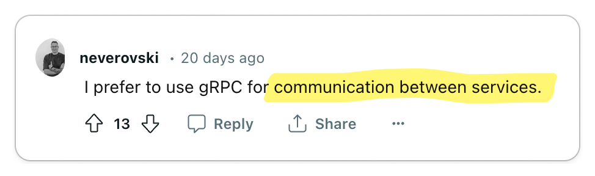

import Head from '@docusaurus/Head';

<Head>
  <title>I Reviewed 1,000s of Opinions on gRPC</title>
  <meta property="og:title" content="I Reviewed 1,000s of Opinions on gRPC"/>
</Head>

<Figure caption="What do developers really think about gRPC?">

</Figure>

It is no secret that [gRPC](https://grpc.io/about/) is widely employed in large
software companies.
[Uber](https://www.uber.com/blog/ubers-next-gen-push-platform-on-grpc/) and
[Netflix](https://netflixtechblog.com/practical-api-design-at-netflix-part-1-using-protobuf-fieldmask-35cfdc606518),
both of which are heavily oriented toward microservices, have extensively
embraced gRPC. While I haven't personally used gRPC, I have colleagues who adore
it. **However, what is the true sentiment among the majority of developers
regarding gRPC?**

To find out, I went to where developers live: Reddit, Twitter, Hacker News, and
YouTube. I parsed 1,000s of discussions and synthesized my findings in this
article, striving to present only thought-provoking opinions.

<Figure caption='Funnel for gathering through-provoking opinions'>

</Figure>

{/* TRUNCATE */}

Next, I transcribed these discussions onto a whiteboard, organizing them into
"Pro-gRPC" (👍), "Anti-gRPC" (👎), or "Neutral" (🧐) categories, and then
clustering them into distinct opinions. Each section in this post showcases an
opinion while referencing pertinent discussions.

<Figure caption='Whiteboard of opinions'>
  
</Figure>

## 👍 gPRC's Code Generation Tooling And Data Format Allow For Amazing Service-To-Service Communication

The largest positive sentiment toward gRPC is focused on its code generation
tooling and data exchange format allowing for sublime service-to-service
developer experience and performance.

<Carousel.Wrapper>
  <Carousel.Slide>
      <Figure caption={<a href="https://news.ycombinator.com/item?id=35751347">Hacker News</a>}>
        
      </Figure>
  </Carousel.Slide>
  <Carousel.Slide>
      <Figure caption={<a href="https://www.reddit.com/r/node/comments/18151z8/comment/kaa8jmo/?utm_source=share&utm_medium=web3x&utm_name=web3xcss&utm_term=1&utm_content=share_button">Reddit</a>}>
        
      </Figure>
  </Carousel.Slide>
  <Carousel.Slide>
      <Figure caption={<a href="https://news.ycombinator.com/item?id=16612816">Hacker News</a>}>
        
      </Figure>
  </Carousel.Slide>
  <Carousel.Slide>
      <Figure caption={<a href="https://www.reddit.com/r/golang/comments/br4awi/comment/eoa25ar/?utm_source=share&utm_medium=web3x&utm_name=web3xcss&utm_term=1&utm_content=share_button">Reddit</a>}>
        
      </Figure>
  </Carousel.Slide>
  <Carousel.Slide>
      <Figure caption={<a href="https://www.youtube.com/watch?v=hVrwuMnCtok&lc=UgxIxKRw5mrXXYFGL854AaABAg">YouTube</a>}>
        
      </Figure>
  </Carousel.Slide>
  <Carousel.Slide>
      <Figure caption={<a href="https://news.ycombinator.com/item?id=26466902">Hacker News</a>}>
        
      </Figure>
  </Carousel.Slide>
  <Carousel.Slide>
      <Figure caption={<a href="https://www.reddit.com/r/golang/comments/br4awi/comment/eoa0m1g/?utm_source=share&utm_medium=web3x&utm_name=web3xcss&utm_term=1&utm_content=share_button">Reddit</a>}>
        
      </Figure>
  </Carousel.Slide>
  <Carousel.Slide>
      <Figure caption={<a href="https://www.reddit.com/r/golang/comments/133lyna/comment/jiav9ys/?utm_source=share&utm_medium=web3x&utm_name=web3xcss&utm_term=1&utm_content=share_button">Reddit</a>}>
        
      </Figure>
  </Carousel.Slide>
  <Carousel.Slide>
      <Figure caption={<a href="https://www.reddit.com/r/golang/comments/133lyna/comment/jiajdxi/?utm_source=share&utm_medium=web3x&utm_name=web3xcss&utm_term=1&utm_content=share_button">Reddit</a>}>
        
      </Figure>
  </Carousel.Slide>
  <Carousel.Slide>
      <Figure caption={<a href="https://www.reddit.com/r/golang/comments/133lyna/comment/jiayabf/?utm_source=share&utm_medium=web3x&utm_name=web3xcss&utm_term=1&utm_content=share_button">Reddit</a>}>
        
      </Figure>
  </Carousel.Slide>
  <Carousel.Slide>
      <Figure caption={<a href="https://www.reddit.com/r/golang/comments/133lyna/comment/jibcznf/?utm_source=share&utm_medium=web3x&utm_name=web3xcss&utm_term=1&utm_content=share_button">Reddit</a>}>
        
      </Figure>
  </Carousel.Slide>
</Carousel.Wrapper>

#### Key Takeaway 🔑

In organizations that utilize numerous internal services, engineering teams are
often responsible for managing multiple services while also interacting with
services managed by other teams. The code generation tools and data formats
offered by gRPC empower developers to expedite their development process and
create more reliable services. The adoption of a standardized data exchange
format, [protobuf](https://protobuf.dev/), encourages engineers to focus primarily on the interfaces and data models
they expose to other teams, promoting a uniform workflow across various groups.

The key benefits of gRPC mentioned were:

- Client and server stub code generation tooling
- Data governance
- Language-agnostic architecture
- Performance
- Well-defined error codes

If your organization is developing a multitude of internal microservices, gRPC
could be an excellent option to consider.

## 👍 gRPC is better than REST/OpenAPI

Given a choice between REST and gRPC, there is no reason to adopt REST.

<Carousel.Wrapper>
  <Carousel.Slide>
      <Figure caption={<a href="https://twitter.com/luke_pighetti/status/1732108363490615594">Twitter</a>}>
        
      </Figure>
  </Carousel.Slide>
  <Carousel.Slide>
      <Figure caption={<a href="https://www.reddit.com/r/golang/comments/br4awi/comment/eoaggs7/?utm_source=share&utm_medium=web3x&utm_name=web3xcss&utm_term=1&utm_content=share_button">Reddit</a>}>
        
      </Figure>
  </Carousel.Slide>
  <Carousel.Slide>
      <Figure caption={<a href="https://www.reddit.com/r/dotnet/comments/r2ekfj/comment/hm4idc8/?utm_source=share&utm_medium=web3x&utm_name=web3xcss&utm_term=1&utm_content=share_button">Reddit</a>}>
        
      </Figure>
  </Carousel.Slide>
</Carousel.Wrapper>

#### Key Takeaway 🔑

When directly comparing gRPC to REST, gRPC is the clear winner. For those

# Conclusion

<Admonition type="info" title="Looking to onboard developers to your api?">
If you are building an API-first company and need docs and SDKs for your API,
consider using our product, [Konfig](/), to easily generate docs and SDKs for your API.
</Admonition>