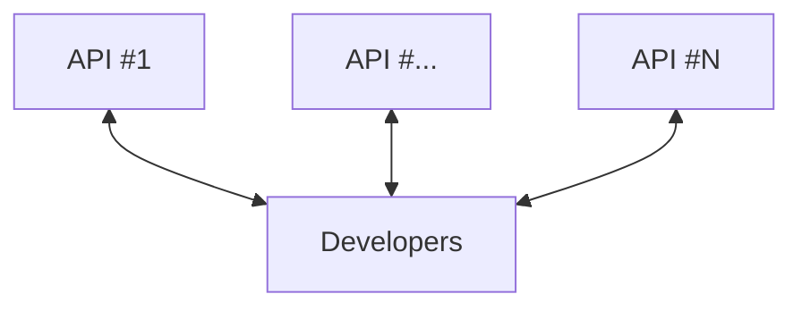

import { SdkSignupForm } from "@site/src/components/SdkSignupForm"

# Introducing Our New Product: Konfig SDKs

Exciting news for developers! We're thrilled to introduce Konfig SDKs, a
collection of SDKs designed to streamline and enhance your software development
process. Konfig SDKs will transform how you integrate external APIs, making your
development faster, your code cleaner, and your integrations more robust.

## Why?

Developers often grapple with the challenges of integrating multiple external
APIs. The inconsistencies in documentation, the need for continuous updates, and
the tedious task of translating these documents into usable SDKs consume
valuable time and resources.

## Features and Benefits

- **Faster Integration with Less Code:** Konfig SDKs allow you to integrate APIs
swiftly, erasing the need to write boilerplate code.
- **Always Up-to-Date:** Stay ahead with SDKs that are automatically updated in
alignment with API changes.
- **Change Notifications:** Receive alerts when an API you depend on undergoes
changes, ensuring your projects stay up-to-date.
- **Unmatched Efficiency:** Build software at an accelerated pace, maintain less
code, and expand your app's capabilities with more external integrations.

## How does it work?

First, we maintain the highest quality collection of OpenAPI Specifications on
the internet. This collection is open and MIT-licensed so you can use it
freely.

We then generate SDKs from the OpenAPI Specifications.

!

By signing up, you get an access token that grants you access to your SDKs. You
can then use the SDKs to integrate the APIs you need into your projects.

## Konfig SDKs vs. Universal API Solutions

Konfig SDKs offer two key advantages over universal API solutions: **pricing and
security**.

### Expensive

Unlike costly universal API solutions that charge $100s per connected account
per month, Konfig SDKs offer a transparent and affordable pricing model. At just
[$50 per month](/sdk/#pricing), you get unlimited access to our SDKs, ensuring
your projects stay within budget.

### Insecure

Moreover, existing universal API solutions also introduce potential security
concerns for data-sensitive applications. By adding a universal API layer to
your infrastructure, you introduce a potential security risk to your data by
potentially storing sensitive information in the provider's infrastructure or
leaking information in-transit. Konfig SDKs, on the other hand, ensure your data
remains secure and private by connecting you directly to the API provider's
infrastructure.

## The Future

At the core of Konfig SDKs is our extensive experience in generating SDKs for
REST APIs from OpenAPI specifications. We understand the developer's plight and
have crafted Konfig SDKs to alleviate these challenges.

We plan to expand
[openapi-examples](https://github.com/konfig-sdks/openapi-examples) and further
refine Konfig SDKs, ensuring you write and maintain less code.

Don't miss out on the opportunity to transform your development workflow. Sign
up below to be among the first to leverage the power of Konfig SDKs.

<SdkSignupForm/>